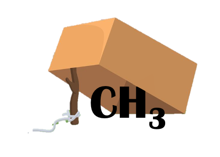

# nf-methTRAP

#### Trim, Repair, Align and Pileup modBam



From modBAm to methylBed

This pipeline take modification basecalled ONT reads (modBam) as input, process the reads (including adapters & barcodes trimming, MM/ML tags repair), align trimmed repaired reads to assembly and then pileup to methylBed. 

Require inputs:

 * modBam 
 * reference genome for alignment 

# Work flow

1. mod basecall - `dorado basecaller` (not included in this pipeline)
2. sort modBam - `samtools sort`
3. convert modBam to fastq - `samtools fastq`
4. trim barcode and adapters - `porechop`
5. repair MM/ML tags of trimmed modBam - `modkit repair `
6. align to reference - `dorado aligner` 
7. check statistics of alignment - `samtools flagstat`
8. sort algined modBam - `samtools sort`
9. index aligned modBam -` samtools index`
10. create bedMethyl - `modkit pileup`
11. filter out reads < 5x coverage, retain only 2 columns ($4 - mod context, $11 - fraction of methylation) for easier downstream analysis in R   
12. create bedgraph from the massive bedMethyl tables as input (chrom, pos1, pos2, mod_cov, canonical_cov) to MethylScore

# Usage

To run the pipeline with a samplesheet on biohpc_gen with charliecloud:

```

nextflow run nf-methTRAP --samplesheet 'path/to/sample_sheet.csv' \
                          --out './results' \
                          -profile biohpc_gen,charliecloud
```

> Note: Porechop, Modkit and Dorado containers are hosted at the LRZ gitlab registry. This requires authentication, currently not handled by nextflow. These containers need to be pre-pulled. Example: 


    ch-image pull --auth gitlab.lrz.de:5005/beckerlab/container-playground/porechop_pigz:4ba2bef9

# Parameters

| Parameter | Effect |
| --- | --- |
| `--samplesheet` | Path to samplesheet |
| `--out` | Results directory, default: `'./results'` |

# Samplesheet

Samplesheet `.csv` with header:

```
sample,modBam,ref
```

| Column | Content |
| --- | --- |
| `sample` | Name of the sample |
| `modBam` | Path to basecalled modBam file |
| `ref` | Path to assembly fasta file |


# Outputs

The outputs will be put into `params.out`, defaulting to `./results`. Inside the results folder, the outputs are structured into 4 main branches, `trim_repair`, `align`. `pileup` and `processed_bed` and in each sub directory, according to the different processors. 
All processess will emit their outputs to results.

# Dependencies 

Required version of `nextflow` - v23.10.1 and `charliecloud` - v0.35

currenty (April 2024) still have to pull containers prior to launching the pipeline, below is an example how to do this 

```bash
export CH_IMAGE_STORAGE=/path/to/work/charliecloud
ch-image pull --auth gitlab.lrz.de:5005/beckerlab/container-playground/modkit:923af692
unset CH_IMAGE_STORAGE 
```
